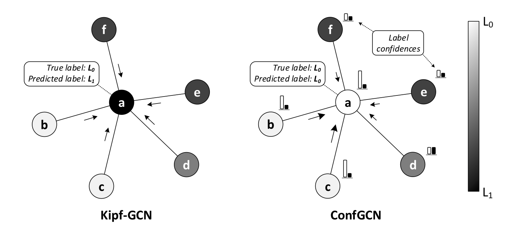

## Confidence-based Graph Convolutional Networks for Semi-Supervised Learning

Source code for [AISTATS 2019](https://www.aistats.org/) paper: [Confidence-based Graph Convolutional Networks for Semi-Supervised Learning](https://shikhar-vashishth.github.io/assets/pdf/confgcn_paper.pdf).

*Label prediction on node a by Kipf-GCN and ConfGCN (this paper). L0 is a’s true label. Shade
intensity of a node reflects the estimated score of label L1 assigned to that node. Since Kipf-GCN is not capable
of estimating influence of one node on another, it is misled by the dominant label L1 in node a’s neighborhood
and thereby making the wrong assignment. ConfGCN, on the other hand, estimates confidences (shown by bars)
over the label scores, and uses them to increase influence of nodes b and c to estimate the right label on a. Please refer to paper for more details.* 

### Dependencies

- Compatible with TensorFlow 1.x and Python 3.x.
- Dependencies can be installed using `requirements.txt`.

### Dataset:

- We use citation network datasets: Cora, Citeseer, Pubmed, and CoraML for evaluation in our paper.
- Cora, Citeseer, and Pubmed datasets was taken directly from [here](https://github.com/tkipf/gcn/tree/master/gcn/data). CoraML dataset was taken from [here](https://github.com/abojchevski/graph2gauss) and was placed in the same format as other datasets for semi-supervised settings. 
- `data.zip` contains all the datasets in the required format.

### Evaluate pretrained model:

- Run `setup.sh` for setting up the environment and extracting the datasets and pre-trained models.
- `confgcn.py` contains TensorFlow (1.x) based implementation of **ConfGCN** (proposed method).
- Execute `evaluate.sh` for evaluating pre-trained **ConfGCN** model on all four datasets.

### Training from scratch:

- Execute `setup.sh` for setting up the environment and extracting datasets. 

- `config/hyperparams.json`contains the best parameters for all four datasets.

- For training **ConfGCN** run:

  ```shell
  python conf_gcn.py -data citeseer -name new_run
  ```

### Citation
Please cite us if you use this code.

```tex
@InProceedings{vashishth19a,
  title = 	 {Confidence-based Graph Convolutional Networks for Semi-Supervised Learning},
  author = 	 {Vashishth, Shikhar and Yadav, Prateek and Bhandari, Manik and Talukdar, Partha},
  booktitle = 	 {Proceedings of Machine Learning Research},
  pages = 	 {1792--1801},
  year = 	 {2019},
  editor = 	 {Chaudhuri, Kamalika and Sugiyama, Masashi},
  volume = 	 {89},
  series = 	 {Proceedings of Machine Learning Research},
  address = 	 {},
  month = 	 {16--18 Apr},
  publisher = 	 {PMLR},
  pdf = 	 {http://proceedings.mlr.press/v89/vashishth19a/vashishth19a.pdf},
  url = 	 {http://proceedings.mlr.press/v89/vashishth19a.html}
}
```

For any clarification, comments, or suggestions please create an issue or contact [shikhar@iisc.ac.in](http://shikhar-vashishth.github.io).
